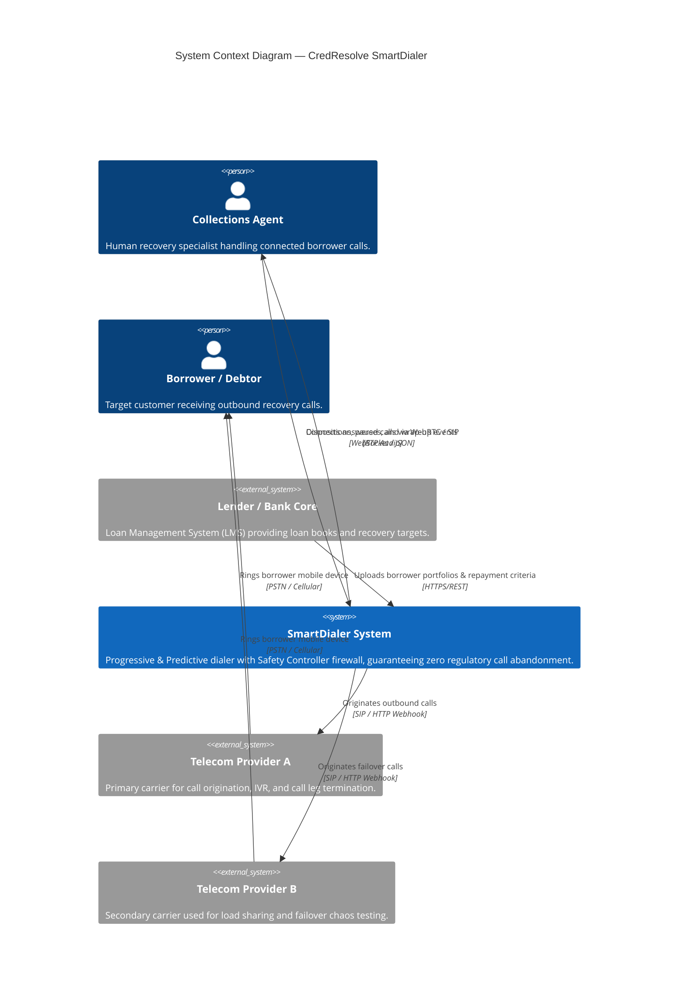
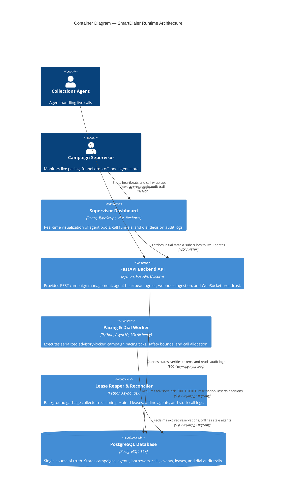

# ARCHITECTURE.md — SmartDialer Architecture & System Design

> Comprehensive architectural specification, C4 model diagrams, sequence interactions, and decision narratives for CredResolve's SmartDialer prototype.

---

## 1. C4 Context Diagram

The SmartDialer orchestrates debt recovery conversations between collections agents and borrowers across multiple lending portfolios, integrating with telecom providers and banking cores while enforcing strict regulatory call abandonment constraints.



---

## 2. Container Diagram

The SmartDialer relies entirely on PostgreSQL as the unified single source of truth, eliminating external cache layers and distributed brokers to ensure transactional state transitions.



---

## 3. Component Diagram (Dialer Core)

The core dialer runtime enforces a strict architectural firewall: the Pacing Engine only produces speculative estimates, the Safety Controller enforces invariant bounds, and only the Call Allocator communicates with telecom providers.

```mermaid
C4Component
  title Component Diagram — Pacing, Safety, and Call Allocation Pipeline

  Container(worker, "Pacing Worker Loop", "AsyncIO Tick Runner", "Drives 1-second campaign ticks inside pg_advisory_xact_lock.")

  Component(pacing, "Pacing Engine", "Progressive / Predictive", "Computes proposed dials based on available agents, soon-to-be-free pipeline F, and historical answer rates.")
  Component(safety, "Safety Controller", "Mathematical Firewall", "Recomputes DB counts; clamps proposals via 99th-percentile closed-form quadratic binomial bound.")
  Component(circuit, "Circuit Breakers", "Failure EWMA & Probe State Machine", "Tracks carrier health; trips to OPEN on consecutive errors or elevated P95 latency.")
  Component(allocator, "Call Allocator", "Atomic Telephony Gateway", "Performs atomic agent SKIP LOCKED reservations and invokes provider originate.")
  Component(providers, "Telecom Providers", "Provider A & Provider B", "Telephony client protocol implementations with latency and chaos simulation.")

  Rel(worker, pacing, "1. Proposes n_proposed dials", "Method call")
  Rel(worker, safety, "2. Requests call approval", "Method call")
  Rel(safety, circuit, "Checks provider health state", "Method call")
  Rel(worker, allocator, "3. Dials n_approved calls", "Method call")
  Rel(allocator, providers, "4. Dispatches originate request", "Method call")

  UpdateRelStyle(pacing, providers, $offsetX="-40", $offsetY="-20")
  note for pacing "STRICT FIREWALL: Pacing engine cannot import or call Providers."
```

---

## 4. Sequence Diagram — A Single Predictive Dial Decision

This diagram illustrates the chronological execution path of a single 1-second pacing tick for an active campaign.

```mermaid
sequenceDiagram
  autonumber
  participant W as Pacing Worker
  participant DB as PostgreSQL DB
  participant PE as Pacing Engine
  participant SC as Safety Controller
  participant CA as Call Allocator
  participant CB as Circuit Breaker
  participant TP as Telecom Provider

  W->>DB: BEGIN txn & SELECT pg_advisory_xact_lock(hash(campaign_id))
  Note over W,DB: Transactional advisory lock prevents double-dialing across racing workers

  W->>PE: propose(campaign_id)
  PE->>DB: Query current p_hat, d_hat, h_hat, alpha
  PE-->>W: Return n_proposed = 17 dials (speculative proposal)

  W->>SC: approve(campaign_id, n_proposed=17)
  SC->>DB: Recompute fresh counts: A (available), R (ringing), C (connected)
  SC->>CB: Query breaker.state
  CB-->>SC: State = CLOSED
  Note over SC: Evaluates closed-form binomial bound: u*(R+n) + z*sqrt((R+n)*u*(1-u)) <= A+F
  Note over SC: Clamps proposal: n_approved = 8, clamp_reasons = ['binomial_safety_bound']
  SC-->>W: Return Approval(n_approved=8)

  W->>DB: INSERT INTO dial_decisions (tick_id, A, R, C, p_hat, n_proposed=17, n_approved=8, clamp_reasons)
  W->>DB: NOTIFY dial_decision, json_payload

  loop For each of 8 approved dials
    W->>CA: dial(campaign_id)
    CA->>DB: Reserve borrower via priority SKIP LOCKED
    CA->>CB: originate(OriginateRequest)
    CB->>TP: originate()
    TP-->>CB: OriginateResult(ok=True, provider_call_id)
    CB-->>CA: Success
    CA->>DB: INSERT INTO calls (state='INITIATED', provider_call_id)
  end

  W->>DB: COMMIT (Releases pg_advisory_xact_lock)
  Note over W,DB: Transaction committed; advisory lock released automatically
```

---

## 5. Architectural Decision Narrative

### Why PostgreSQL As The Single Source of Truth?
In collections dialing systems, state drift between a caching layer (such as Redis or Memcached) and a durable database is the primary root cause of double-dialing and call abandonment. When a Redis cache reports an agent as `AVAILABLE` but the database has already transitioned them to `RESERVED` due to an in-flight call setup race, an over-dial occurs. When the customer picks up, no agent is free, resulting in a silent abandonment and a direct compliance violation under RBI fair-practices debt recovery guidelines.

By selecting PostgreSQL as the single source of truth, we leverage row-level transactional locking with `FOR UPDATE SKIP LOCKED`. This completely eliminates Time-Of-Check to Time-Of-Use (TOCTOU) race conditions. Worker processes never synchronize state through in-memory flags or distributed message queues; the atomic state of an agent or borrower is determined by the database row itself. Postgres advisory locks (`pg_advisory_xact_lock`) serialize campaign ticks per campaign ID with zero external lock manager overhead, automatically releasing locks on worker failure or transaction rollback.

### Why The Pacing / Safety Controller / Call Allocator Firewall?
A classic flaw in predictive dialers is blending aggressive dialing heuristics with telephony execution code. Over time, optimization pressure leads engineers to add speculative shortcuts that bypass capacity checks.

To establish an immutable architectural guarantee, we decoupled the pipeline into three strictly separated layers enforced by import linting:
1. **The Pacing Engine** is purely speculative. It computes what it *wants* to dial based on historical answer rates ($p$), call setup durations ($d$), and handle times ($h$). It has zero knowledge of telecom providers and cannot import any provider modules.
2. **The Safety Controller** is the non-bypassable runtime firewall. It rejects the pacing engine's numbers and independently recomputes agent and in-flight counts directly from PostgreSQL. It calculates the 99th-percentile upper confidence bound on answer rates and clamps dials so that over-answering cannot exceed agent capacity. If the telecom provider's circuit breaker trips, or if recent abandonment exceeds 3%, it forces an immediate progressive fallback.
3. **The Call Allocator** is the only component in the entire codebase authorized to import telecom providers. It executes atomic agent claims and dispatches calls.

This separation is validated on every build by an automated import firewall test (`tests/test_import_firewall.py`) and `.importlinter` configuration.

### Why Injected Clock Abstraction?
Deterministic reproducibility is essential for validating distributed pacing behavior and chaos scenarios. If domain code calls system wall time directly (`time.time()` or `datetime.now()`), simulating high-density failure scenarios (such as drifting answer rates over 10 minutes or 30-second TTL lease expirations) requires waiting in real time or introduces non-deterministic test flakiness.

By injecting a `Clock` protocol into all domain state machines, pacing algorithms, reaper jobs, and circuit breakers, we can execute 10-minute simulations (600 discrete 1-second decision ticks) in under 2 seconds. Identical seeds produce byte-identical JSON and CSV audit logs, enabling regression verification of mathematical tuning decisions.
